# **WordFlash**
--------------------------------------------------------------------------------------------------------

WordFlash — это мобильное приложение, разработанное для помощи пользователям в изучении новых слов с использованием карточек. Приложение позволяет создавать собственные коллекции карточек, просматривать статистику по выученным словам и проходить тесты на запоминание.

--------------------------------------------------------------------------------------------------------
## **Функциональные возможности**

--------------------------------------------------------------------------------------------------------

  * Создание и редактирование коллекций карточек.
  * Прослушивание произношения слов.
  * Два типы тестов:
      1. тест на запоминание (переворот карточки);
      2. тест на ввод определения слова с клавиатуры.
  * Просмотр статистики по выученным словам и коллекциям.
  * Возможность смены пароля и никнейма.

--------------------------------------------------------------------------------------------------------

## **Технологии**
--------------------------------------------------------------------------------------------------------

  Язык разработки: Java
  Среда разработки: Android Studio
  Библиотеки: ...

--------------------------------------------------------------------------------------------------------

## **Мокапы приложения**
--------------------------------------------------------------------------------------------------------

### Авторизация пользователя
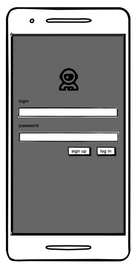
### Главная страница добавление новой коллекции/карточки 
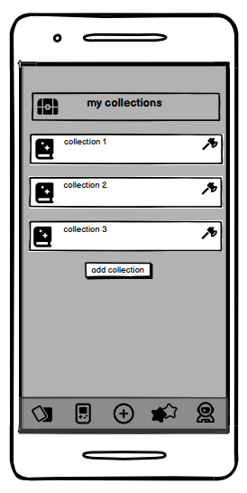
#### Коллекция
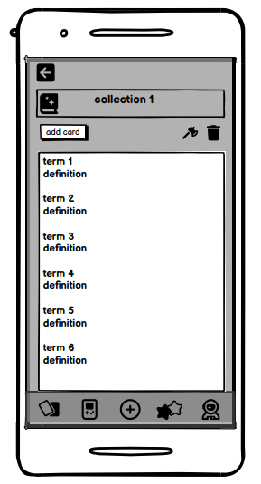
#### Добавление новой коллекции/карточки
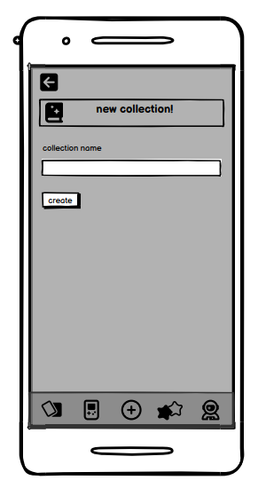
### Страница тестирования
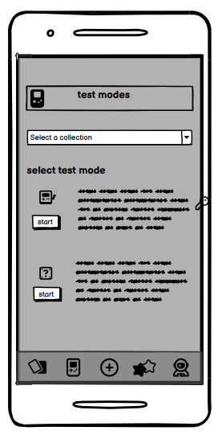
#### Флешкарточки
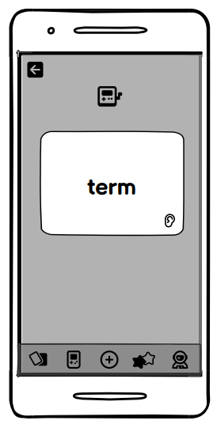
#### Письменный тест
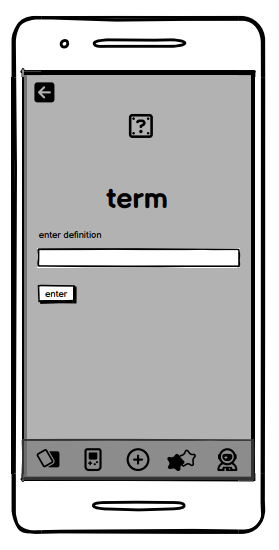
#### Результаты тестов
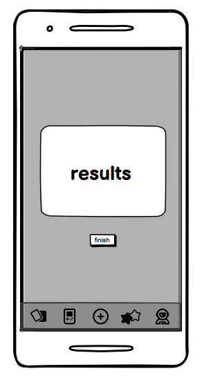
### Статистика пользователя
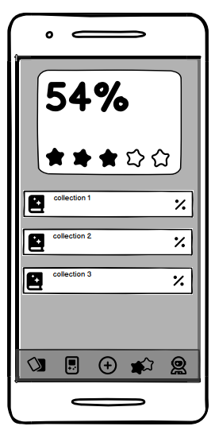
### Персональная страница
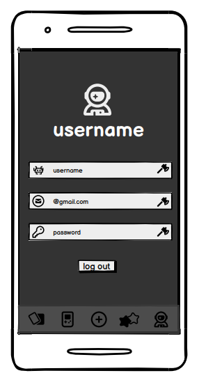
#### Изменение имени пользователя
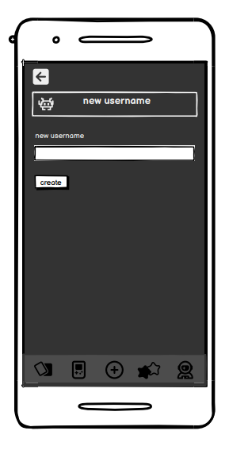
#### Изменение пароля
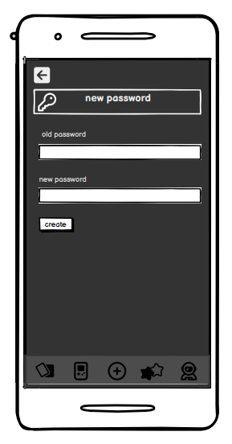

--------------------------------------------------------------------------------------------------------

